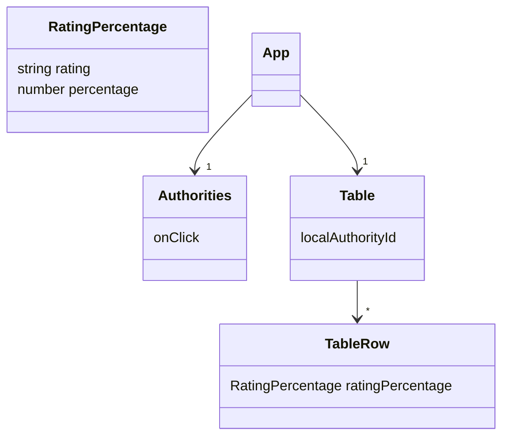

A [Spring Boot](https://spring.io/projects/spring-boot) server with a [React](https://reactjs.org/) front end hosted in two ways using [AWS and terraform](https://github.com/jg210/aws-experiments).

* https://aws.jeremygreen.me.uk
* http://spring-experiments.jeremygreen.me.uk

Testing is done using:

* [React Testing Library]( https://testing-library.com/docs/react-testing-library/intro/) etc. for front-end unit/integration tests.
* [MockMvc](https://docs.spring.io/spring-framework/reference/testing/spring-mvc-test-framework.html) for testing server.
* [Cypress](https://www.cypress.io/) for end-to-end tests.

[Sentry](https://sentry.io) is used for crash reporting and analytics.

[](https://github.com/jg210/spring-experiments/actions/workflows/checks.yml)

## Front End


The [front end](src/frontend) uses [React](https://react.dev/). It uses [React Tool Kit Query](https://redux-toolkit.js.org/rtk-query/overview) to connect to the API. Type checking is done using [TypeScript](https://www.typescriptlang.org/).

## Server

The front end makes requests to an API provided by the Spring Boot server. The server handles these requests by aggregrating data provided by a [third-party REST API](http://api.ratings.food.gov.uk/help).

## Development Build Instructions

Configure python venv:

```
sudo apt-get install -y build-essential libssl-dev zlib1g-dev libbz2-dev libreadline-dev libsqlite3-dev curl libncursesw5-dev xz-utils tk-dev libxml2-dev libxmlsec1-dev libffi-dev liblzma-dev
git clone https://github.com/pyenv/pyenv.git ~/.pyenv
bin/setup
. ./environment
```

Install nodenv and node-build (or use any other way to put correct version of node on PATH):

* https://github.com/nodenv/nodenv#installation
* https://github.com/nodenv/node-build#installation

Configure github action repository secret and local env. var. called SENTRY_DSN_SPRING_EXPERIMENTS with the [Sentry DSN](https://docs.sentry.io/product/sentry-basics/concepts/dsn-explainer/).

To build and run the Spring Boot server from the command line:

```
./gradlew build bootRun
```

Its API can be accessed directly using e.g.:

* http://localhost:8080/api/fsa/localAuthority
* http://localhost:8080/api/fsa/localAuthority/1


The React front end is not bundled into the jar when doing development builds, and needs to be run separately. To do this...

Then run this:

```
cd src/frontend
nodenv install
npm install
npm start
```

View the application using:

http://localhost:3000/

API requests are forwarded to the spring boot server using proxy in vite.config.ts.

To test locally on mobile device:

```
adb reverse tcp:3000 tcp:3000
```

## Release Build Instructions

Build using one of:

```
./gradlew bootJar # to run locally
./gradlew shadowJar # for AWS lambda
```

The React app will be built and bundled into the jar.

## IDEs

It is possible to build and run the Spring Boot server using Visual Studio Code. However, for development, [IntelliJ IDEA](https://www.jetbrains.com/idea/) is better. 

For the React front end:

* Install [Visual Studio Code](https://code.visualstudio.com/) (VSC), then run it like this:

```
code spring-experiments.code-workspace
```

* Accept "workspace recommendations" in VSC to install required plugins.

* Restart VSC after installing its plugins, otherwise debugging using Chrome doesn't work.

* Make sure VS code is using the project's TypeScript version (from package.json).

* Install Google Chrome (for debugging with VSC).

* Install React Developer Tools in Chrome.

## Debugging lambda function locally

The lambda function is deployed with terraform not SAM, but SAM can be used to run the lambda function locally.

Need to use `--warm-containers EAGER`. Otherwise, concurrent requests from the browser make SAM [crash](https://github.com/aws/aws-sam-cli/issues/6663) when it tries to clean up files concurrently. Also, it's much faster.

The `sam` executable is installed as a python pip.

To start a local server running the lambda function (using template.yaml):

```
. environment
./gradlew shadowJar
sam local start-api --warm-containers EAGER
```

## Cypress

To run cypress end-to-end tests against already-running development server:

```
. environment
cd src/frontend
cypress run
```

## GitHub Action publishing

Create access key for aws-experiments gha IAM user, then configure the following repository variables (for master branch only):

* AWS_ACCESS_KEY_ID
* AWS_SECRET_ACCESS_KEY - with minimal permissions.

## Analysis of API

This app aggregates data from this API: http://api.ratings.food.gov.uk/help.

All HTTP requests are slow. The API is http only.

This gives a list of Authorities:

```
$ curl http://api.ratings.food.gov.uk/Authorities/basic -H "x-api-version: 2" -H "accept: text/json" > authorities.json
```

There are currently 392 authorities:

```
$ cat authorities.json | jq '.authorities[].Name' | wc -l
```

This lists Establishments for a single localAuthorityId:

```
$ curl 'http://api.ratings.food.gov.uk/Establishments?localAuthorityId=23&pageSize=0' -H "x-api-version: 2" -H "accept: text/json" > establishments_23.json
```

The localAuthorityId in the URL is the LocalAuthorityId not the LocalAuthorityIdCode in Authorities json.

These look like they should be hygiene scores, but are from 0 to 20 not 1 to 5:

```
$ jq '.establishments[].scores.Hygiene' example_json/establishments_23.json | sort | uniq --count | sort -k2 -n
    121 0
     97 null
    577 5
     96 10
     19 15
      1 20
```

These look more plausible, but there are 6 not 5 levels:

```
$ jq '.establishments[].RatingKey' example_json/establishments_23.json | sort | uniq --count | sort -k2 -n
     12 "fhrs_1_en-gb"
    160 "fhrs_4_en-gb"
     18 "fhrs_2_en-gb"
      2 "fhrs_0_en-gb"
    577 "fhrs_5_en-gb"
     61 "fhrs_exempt_en-gb"
      6 "fhrs_awaitinginspection_en-gb"
     75 "fhrs_3_en-gb"
```

This API gives the mapping from ratingKey (like fhrs_1_en-gb) to ratingName (e.g. 1):

```
$ curl 'http://api.ratings.food.gov.uk/Ratings' -H "x-api-version: 2" -H "accept: text/json" > ratings.json
$ jq .ratings[].ratingName example_json/ratings.json
"5"
"4"
"3"
"2"
"1"
"0"
"Pass"
"Improvement Required"
"Awaiting Publication"
"Awaiting Inspection"
"Exempt"
$ cat ratings.json | jq .ratings[].ratingKey
"fhrs_5_en-gb"
"fhrs_4_en-gb"
"fhrs_3_en-gb"
"fhrs_2_en-gb"
"fhrs_1_en-gb"
"fhrs_0_en-gb"
"fhis_pass_en-gb"
"fhis_improvement_required_en-gb"
"fhis_awaiting_publication_en-gb"
"fhis_awaiting_inspection_en-gb"
"fhis_exempt_en-gb"
```

Helpfully, this is denormalized into the RatingValue field:

```
$ jq .establishments[].RatingValue example_json/establishments_23.json | sort | uniq --count
      2 "0"
     12 "1"
     18 "2"
     75 "3"
    160 "4"
    577 "5"
      6 "AwaitingInspection"
     61 "Exempt"
```

## Same Origin Policy and CORS

Originally, for simplicity, the React app made FSA API requests from the browser. It was able to do this without using a proxy since the ratings server sets the "Access-Control-Allow-Origin: *" [CORS](https://en.wikipedia.org/wiki/Cross-origin_resource_sharing) header:

```
$ curl 'http://api.ratings.food.gov.uk/Ratings' -H "x-api-version: 2" -H "accept: text/json" --verbose > /dev/null 
> User-Agent: curl/7.35.0
> Host: api.ratings.food.gov.uk
> x-api-version: 2
> accept: text/json
> 
< HTTP/1.1 200 OK
< Cache-Control: public, max-age=600
< Content-Type: text/json; charset=utf-8
* Server Microsoft-IIS/8.5 is not blacklisted
< Server: Microsoft-IIS/8.5
< X-Version: v2.0
< X-Provider: Food Standards Agency
< Access-Control-Allow-Origin: *
< Access-Control-Allow-Methods: GET, POST
< Access-Control-Allow-Headers: Authorization, ApiKey, X-Api-Version
< Set-Cookie: ApplicationGatewayAffinity=c436113542c9b22bfefbedeae95a339e13778ca898918f178726c359d131e0a1;Path=/;Domain=api.ratings.food.gov.uk
< Date: Sun, 30 Sep 2018 10:00:09 GMT
< Content-Length: 2333
```

...and since it was hosted using http only (it's not possible to make http calls from an https-hosted web app). The FSA API is now proxied by an API provided by the same spring application that also hosts the react web app, avoiding these restrictions. 
